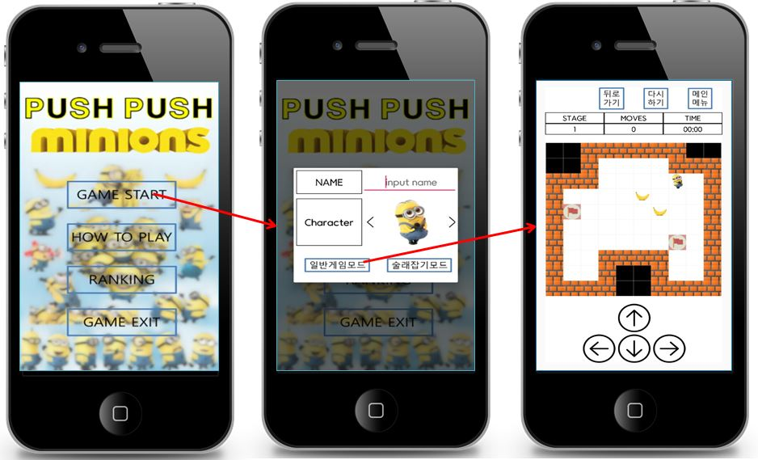
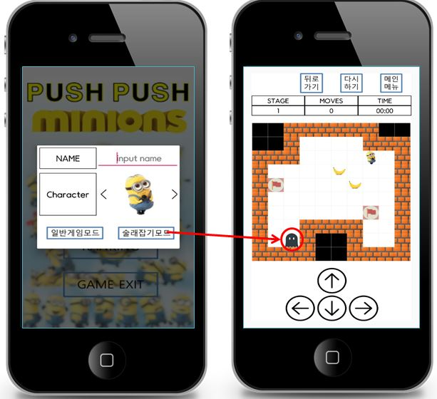
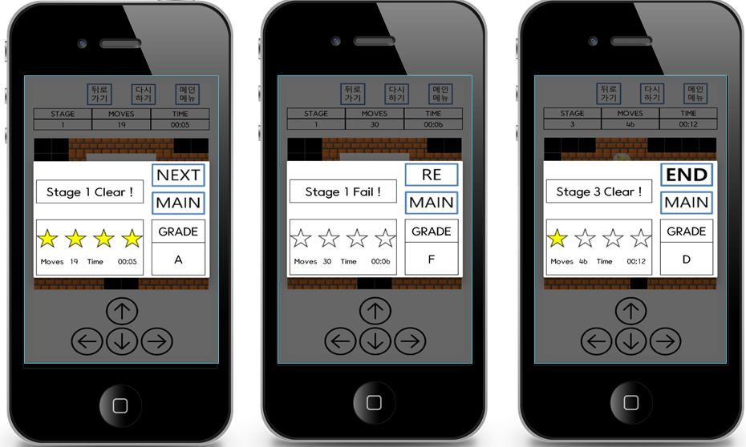
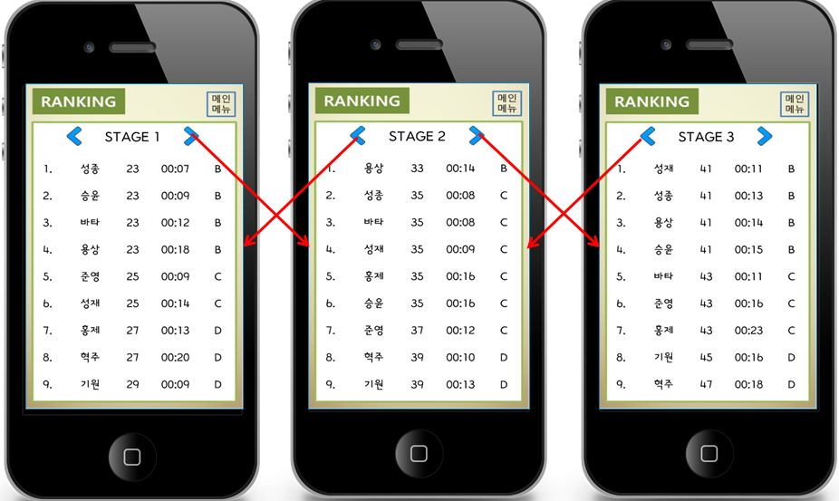

# PushPush_Game

## About
- 소개
  1. 일반모드
      - 주어진 캐릭터를 움직여 물체들을 지정된 장소로 옮기는 게임입니다. 구슬들은 사방이 벽으로 닫혀있는 방 안에 놓여있고 캐릭터는 상하좌우로 움직일 수 있지만, 벽이나 구슬을 뛰어 넘어갈 수는 없습니다. 또한 캐릭터는 구슬을 한번에 하나씩만 밀 수 있을 뿐 구슬을 당기거나 한번에 여러개를 밀진 못하기 때문에 목표를 달성하기 위해서는 매번 캐릭터를 신중하게 움직여야 합니다.
  2. 술래잡기모드
      - 일반모드에서 Ghost가 추가됩니다. Ghost는 캐릭터를 1초마다 쫓아옵니다. Ghost에게 잡히면 게임을 패합니다.
      - 너비 우선 탐색하여 ghost에서 캐릭터까지의 최단 경로를 계산하여 저장한 후 stack을 이용 push하며 역추적해서 ghost의 다음 경로를 지정해줍니다.
- 기간
  - 2016.11.01 ~ 2016.12.13
- 관련기술
  - Android, SQLite

## Preview
|  |
|:---:|
|  |
|  |
|  |
